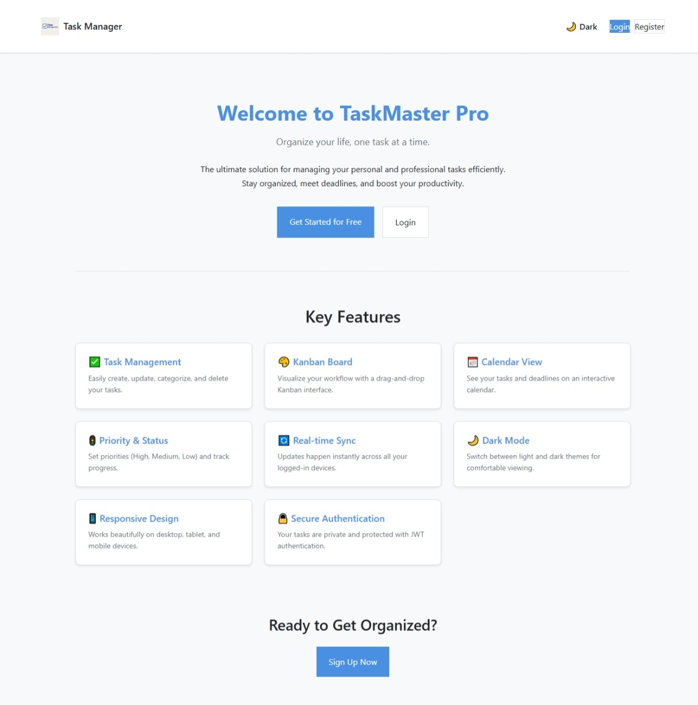
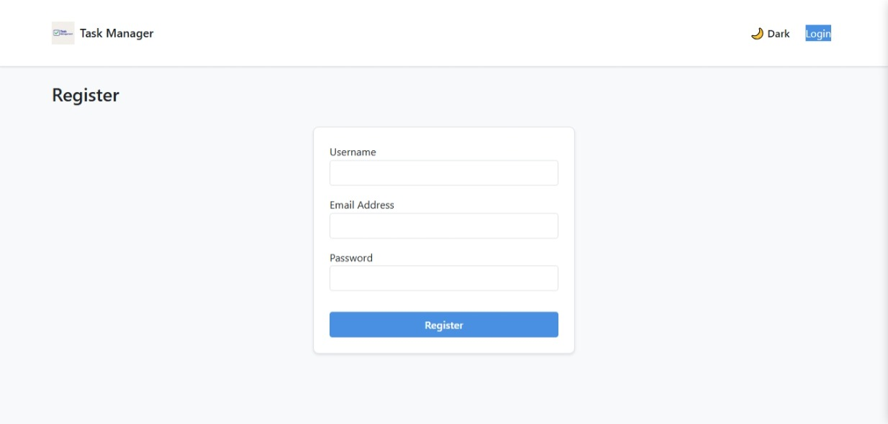
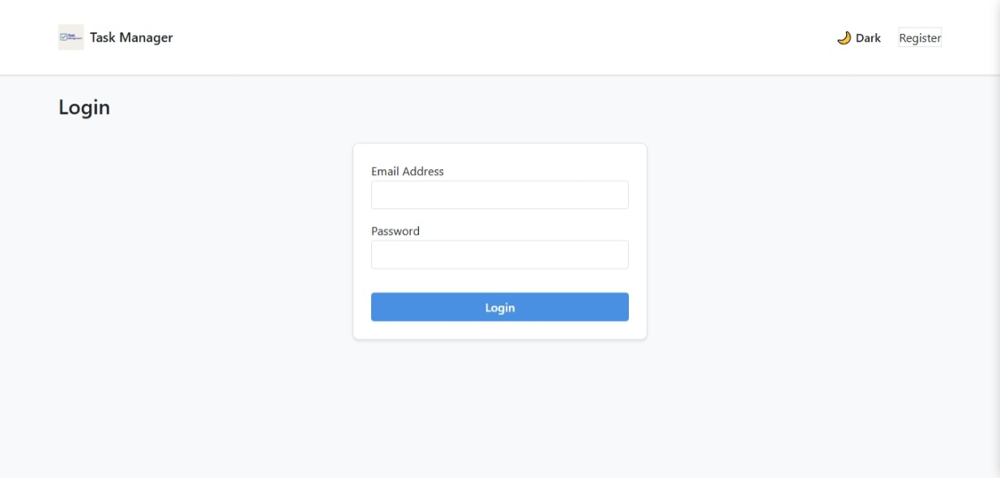
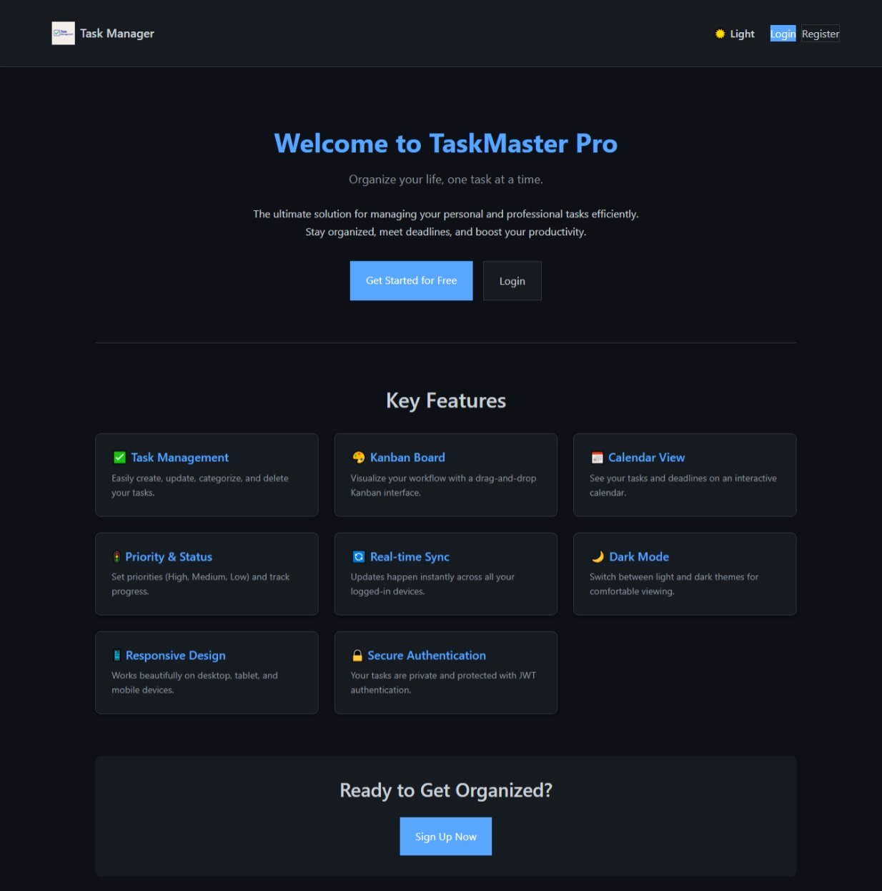
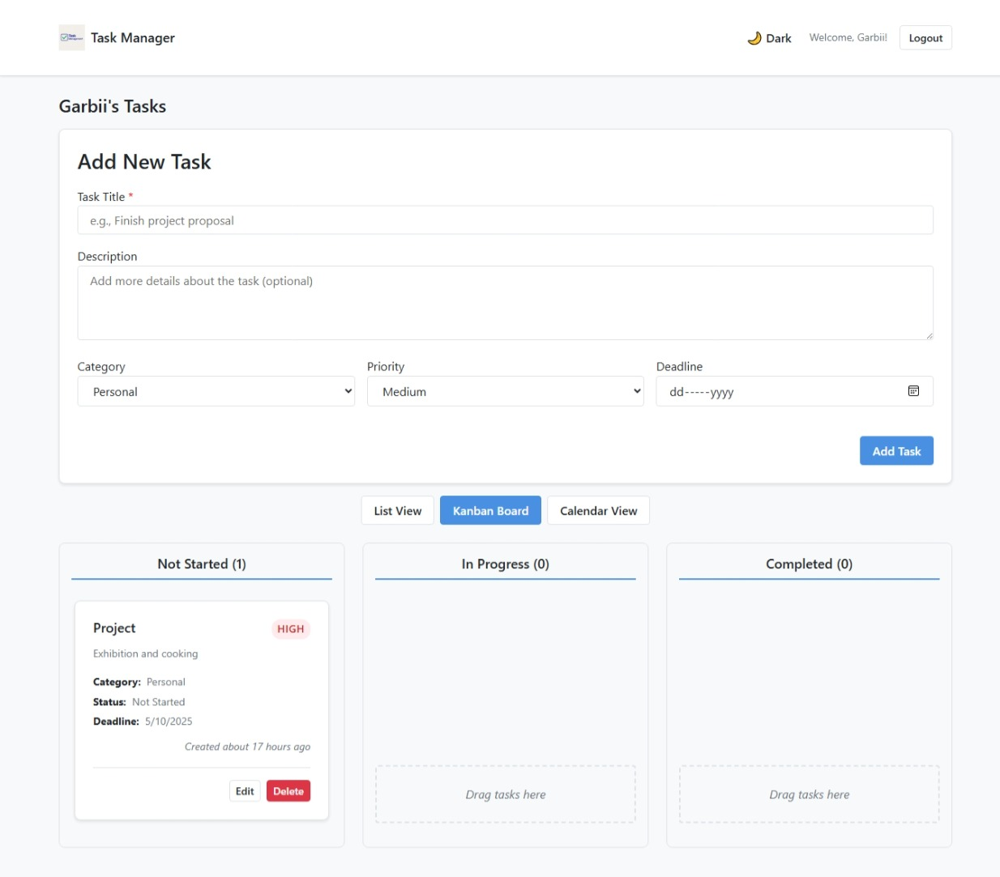
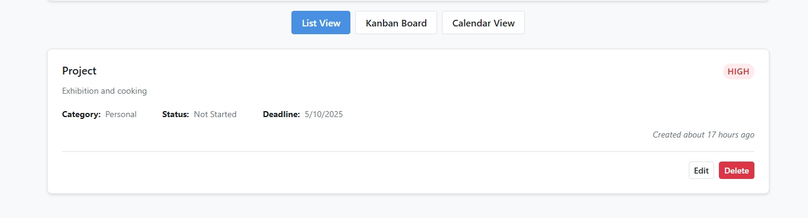
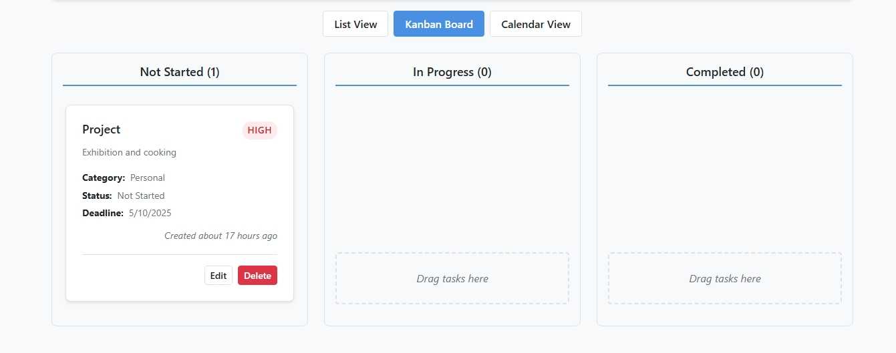
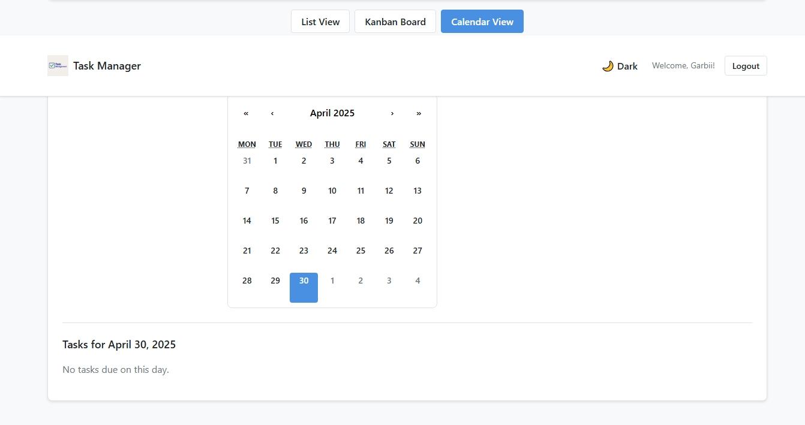

# Full-Stack Task Management App (TaskMaster Pro - Monorepo)

A comprehensive task management web application built with the MERN stack (MongoDB, Express, React, Node.js) plus real-time capabilities using Socket.IO, all managed within a single repository. Organize your tasks efficiently with features like categorization, deadlines, priorities, a Kanban board, and a calendar view.

**[View Live Demo](https://fullstack-task-manager-alpha.vercel.app/)**










## Overview

This project is a full-stack web application designed to help users manage their tasks effectively. Users can perform CRUD operations on tasks, assign various properties like categories, priorities, and deadlines, and visualize their workflow using different views like a list, a drag-and-drop Kanban board, and a calendar. Real-time synchronization ensures that changes are reflected instantly across all connected clients. The application also features JWT-based authentication, a responsive design, and a dark/light theme toggle. Both the frontend and backend code are contained within this single repository.

## Features Implemented

-   [x] **User Authentication:** Secure JWT-based Register & Login.
-   [x] **Task CRUD:** Create, Read, Update, and Delete tasks.
-   [x] **Task Properties:** Assign Categories (Work, Personal, Hobby, Other), Deadlines, Priority (High, Medium, Low), and Status (Not Started, In Progress, Completed).
-   [x] **Kanban Board View:** Visualize tasks by status with drag-and-drop functionality (`react-beautiful-dnd`).
-   [x] **Calendar View:** View tasks based on their deadlines (`react-calendar`).
-   [x] **List View:** Simple list display of tasks.
-   [x] **Real-time Updates:** Instant synchronization across clients using WebSockets (`socket.io`).
-   [x] **Dark/Light Mode Toggle:** User preference saved in local storage.
-   [x] **Responsive Design:** Adapts to Mobile, Tablet, and Desktop screens.
-   [x] **Homepage:** Landing page for unauthenticated users.
-   [x] **Protected Routes:** Dashboard and task-related actions require login.
-   [x] **Loading & Empty States:** User-friendly indicators.
-   [x] **Error Handling:** Notifications for API or validation errors.
-   [x] **Modal Popups:** Used for editing tasks smoothly.

## Tech Stack

**Frontend (`task-manager-frontend` directory):**
*   React.js (v18)
*   React Router (`react-router-dom`) for routing
*   Axios for API requests
*   Socket.IO Client (`socket.io-client`) for real-time communication
*   React Beautiful DnD (`react-beautiful-dnd`) for drag & drop
*   React Calendar (`react-calendar`) for calendar view
*   `date-fns` for date formatting
*   CSS (with CSS Variables for theming)

**Backend (`task-manager-backend` directory):**
*   Node.js
*   Express.js framework
*   MongoDB Atlas (Cloud Database - Free Tier)
*   Mongoose (ODM for MongoDB)
*   Socket.IO (`socket.io`) for real-time communication
*   JSON Web Token (`jsonwebtoken`) for authentication
*   `bcryptjs` for password hashing
*   `cors` for handling Cross-Origin Resource Sharing
*   `dotenv` for environment variables

**Database:**
*   MongoDB (via MongoDB Atlas Free Tier)

**Deployment:**
*   Frontend: Vercel (Free Plan)
*   Backend: Render (Free Plan)

## Getting Started

To run this project locally from the monorepo, follow these steps:

**Prerequisites:**
*   Node.js and npm (or yarn) installed
*   Git installed
*   A free MongoDB Atlas account

**1. Clone the Repository:**
   ```bash
   git clone https://github.com/Garbii1/fullstack-task-manager.git
   cd fullstack-task-manager
Use code with caution.
Markdown
(You are now in the root of the monorepo)
2. Setup Backend:
Navigate into the backend directory:
bash cd task-manager-backend
Install backend dependencies:
bash npm install
Create a .env file in the task-manager-backend directory.
Add the following environment variables:
dotenv MONGO_URI=<your_mongodb_atlas_connection_string> JWT_SECRET=<your_strong_jwt_secret> PORT=5000 CORS_ORIGIN=http://localhost:3000 # Allow frontend dev server
Run the backend development server (from within task-manager-backend):
bash npm run dev
The backend should be running on http://localhost:5000. Keep this terminal running.
3. Setup Frontend:
Open a new terminal window/tab.
Navigate from the monorepo root into the frontend directory:
bash cd path/to/fullstack-task-manager/task-manager-frontend # Example: cd ../task-manager-frontend (if you are still in the backend dir) # Or: cd C:\Users\GARBII\Documents\fullstack-task-manager\task-manager-frontend
Install frontend dependencies:
bash npm install
Create a .env file in the task-manager-frontend directory.
Add the following environment variables:
dotenv REACT_APP_API_URL=http://localhost:5000/api REACT_APP_SOCKET_URL=http://localhost:5000
Run the frontend development server (from within task-manager-frontend):
bash npm start
The frontend should open automatically in your browser at http://localhost:3000.
API Endpoints Overview
(API code resides in the task-manager-backend directory)
Authentication (/api/auth)
POST /register: Register a new user.
POST /login: Log in an existing user, returns JWT token.
GET /me: Get the profile of the currently logged-in user (Protected).
Tasks (/api/tasks) (All protected)
GET /: Get all tasks for the logged-in user.
POST /: Create a new task.
GET /:id: Get a specific task by ID.
PUT /:id: Update a specific task by ID.
DELETE /:id: Delete a specific task by ID.
Deployment Notes (Monorepo)
Backend (Render):
Connect the single GitHub repository (fullstack-task-manager).
Crucially, set Root Directory: task-manager-backend.
Build Command: npm install.
Start Command: npm start.
Environment Variables: MONGO_URI, JWT_SECRET, PORT, CORS_ORIGIN (set to your Vercel frontend URL).
Frontend (Vercel):
Connect the single GitHub repository (fullstack-task-manager).
Crucially, set Root Directory: task-manager-frontend.
Framework Preset: Create React App (should auto-detect).
Environment Variables: REACT_APP_API_URL (set to your Render backend URL + /api), REACT_APP_SOCKET_URL (set to your Render backend URL).
Challenges Faced & Solutions
Dependency Conflicts: Encountered issues with react-beautiful-dnd requiring React 18 while the project was initialized with React 19. Solution: Downgraded React to v18 across the frontend project.
Real-time Sync Logic: Ensuring updates broadcasted via Socket.IO correctly updated the state across different components (List, Kanban, Calendar) required careful state management and event handling within the React app. Solution: Centralized socket listeners in DashboardPage and passed down necessary handlers/data.
CORS Configuration: Setting up CORS correctly between the Vercel frontend and Render backend, especially differentiating between development (localhost) and production origins. Solution: Used environment variables for CORS_ORIGIN on the backend.
Monorepo Deployment: Configuring Render and Vercel to correctly identify the Root Directory for the backend and frontend within this single repository. Solution: Explicitly setting the "Root Directory" in each platform's settings (task-manager-backend for Render, task-manager-frontend for Vercel).
Future Improvements
Task Reminders/Notifications (via email or browser notifications)
Task Search & Filtering functionality
Editable Task History / Audit Log
User Profile Page / Settings
Public Shareable Boards/Tasks
Add Unit/Integration Tests
Author
Muhammed Babatunde Garuba
GitHub: @Garbii1
License
This project is licensed under the MIT License - see the LICENSE file for details.
[](https://opensource.org/licenses/MIT)